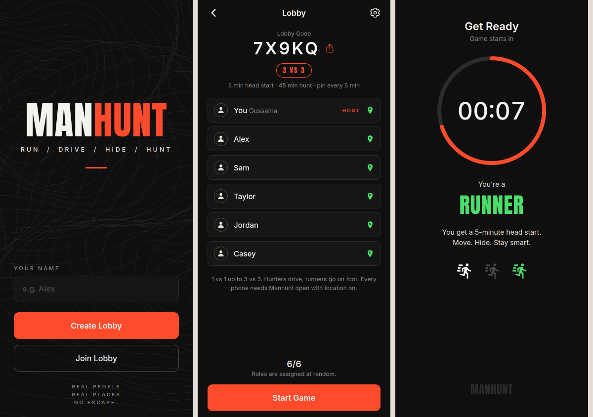
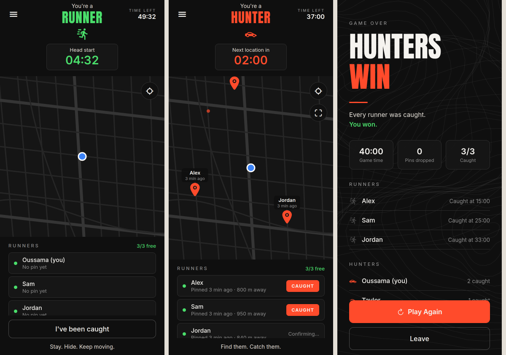

# MANHUNT

**Run / Drive / Hide / Hunt.** A real-world chase game for iOS and Android. Two teams play in the same city: **runners** on foot and **hunters** in a car. Runners get a 5-minute head start. After that, the hunters get a location pin for each runner. It's the runner's position at that moment, not a live location. New pins keep dropping on a timer until the hunters catch every runner or time runs out.




## How a game works

1. **Everyone installs the app** and turns on location.
2. **One player creates a lobby.** They get a 5-character code (e.g. `7X9KQ`) and share it with the invite button.
3. **Everyone else joins** with the code. The lobby holds 2–6 players, so it can be **1 vs 1** up to **3 vs 3**. With an odd number, runners get the extra player (e.g. 2 vs 3).
4. **The host taps Start Game.** The app **randomly assigns hunters and runners**, then shows everyone a 10-second "Get Ready" countdown with their role.
5. **Head start (5 min by default).** Runners get moving. Hunters see a "Stay put" screen and a countdown to the first location.
6. **The hunt.** When the head start ends, each runner's phone sends its current GPS position once, and a pin shows up on the hunters' map. After that, a new pin drops every *N* minutes (the host picks this). Hunters see how old each pin is and how far away it is. A runner's app warns them in the last 30 seconds before their next pin goes out.
7. **Catching.** A hunter taps **CAUGHT** next to a runner, and the runner confirms on their own phone. A runner can also tap **I've been caught**. Caught runners stay in the game as spectators.
8. **The game ends when:**
   - every runner is caught → **Hunters win**
   - the hunt timer runs out → **Runners escape**
   - all hunters quit, or the host ends the game.
9. **Results screen:** who got caught and when, and how many catches each hunter made. The host can tap **Play Again** to go back to the lobby, and roles are shuffled again.

The host can change these in the lobby (gear icon): head start (3/5/10 min), hunt length (30/45/60/90 min) and pin interval (2/3/5/10 min).

### Fair play by design
- Runner positions are **never streamed live**. A runner's phone only uploads its position at pin-drop time, so the location isn't in the database for hunters to read early.
- Every phone syncs its clock with the server, so the head start ending and each pin drop happen at the same moment on every phone.
- If the app restarts in the middle of a game, it puts you straight back into that game.

## Tech

- [Expo](https://expo.dev) SDK 57 / React Native (JavaScript)
- `expo-location` for GPS, `react-native-maps` for the dark map
- Firebase: anonymous auth plus Firestore for the live lobby and pins. No custom server.
- Fonts: Anton (headlines) and Inter (UI), in the moodboard palette: orange `#FF4B2B`, black, graphite, olive, sand and off-white.

```
App.js                 fonts, auth, and a router driven by the lobby's status
src/game/logic.js      pure rules: phases, pin rounds, role assignment, win check
src/game/api.js        Firestore reads and writes (lobby, join, start, catch, pings)
src/hooks/             useLobby, useNow (server-synced clock), useMyLocation, useRunnerPings
src/screens/           Home, Lobby, GetReady, Game (runner + hunter), Results, Setup
src/components/        buttons, logo, countdown ring, topographic background, map style
firestore.rules        security rules
tests/                 unit tests for the game logic (npm test)
```

## Setup

### 1. Firebase (free tier is enough)
1. Create a project at <https://console.firebase.google.com>.
2. **Build → Authentication → Sign-in method → Anonymous → Enable.**
3. **Build → Firestore Database → Create database.**
4. Deploy the rules: `npx firebase-tools deploy --only firestore:rules`, or paste `firestore.rules` into the console's **Rules** tab.
5. **Project settings → Your apps → Add app → Web**, then copy the config values.

### 2. Run it
```bash
cd manhunt
cp .env.example .env      # paste the Firebase values
npm install
npx expo start
```
Scan the QR code with **Expo Go** on each player's phone.

### 3. Build installable apps
```bash
npx eas-cli@latest build --platform android   # or ios
```
For Android release builds, set `GOOGLE_MAPS_ANDROID_API_KEY` in `.env` or as an EAS secret, because Google Maps needs a key outside Expo Go.

## Notes and next steps
- **Keep the app open during a game.** The app keeps the screen awake, but the operating system pauses apps in the background, so a runner who locks their phone may miss a pin. The next step is background location (`expo-task-manager` plus `Location.startLocationUpdatesAsync`) in a development build.
- Push notifications for pin drops (`expo-notifications`) would let hunters keep their phones in their pockets.
- Tests: `npm test`.
